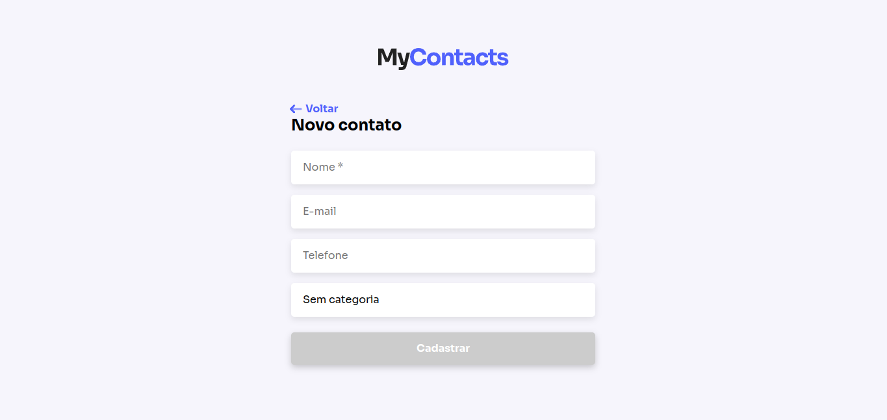

## Projeto

Aplicação full stack para fazer o gerenciamento completo de uma agenda de contatos. Incluindo ações como: lista, adicionar, editar, e deletar contatos.

## Tecnologias

- ReactJs
- Styled Components
- Tipagem estática com Prop-Types

## Conhecimentos

Dentro muitos assuntos abordados profundamente durante as aulas temos:

- Consumo de api por meio da Fetch Api do javascript.
- Utilização dos hooks de memorização useMemo e useCallback para melhorar a performance da aplicação.
- Criação e utilização de um componente global (toast) tendo como base técnicas de animação avançada.
- Padrões de projeto
- Clean code

<br/>



## Como executar

_Será necessário ter o gerenciador de pacotes Yarn instalado._

1. Executar a api que se encontra neste repositório: [mycontacts-backend](https://github.com/guilhermanosilva/mycontacts-backend)

2. No terminal, dentro da pasta raiz do código, instale as dependências executando o comando:

```bash
yarn install
```

3. Com a api em execução e todas as dependências instaladas, execute o seguinte comando para visualizar a página:

```bash
yarn start
```

## Agradecimentos

Equipe [JStack](https://jstack.com.br) e professor [Mateus Silva](https://www.linkedin.com/in/mateusilva/?locale=pt_BR)!

## Contato

> Guilhermano Silva - [LinkedIn](https://www.linkedin.com/in/guilhermanosilva) - guilhermanosilva@gmail.com
